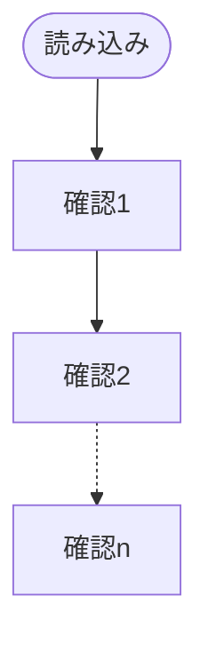
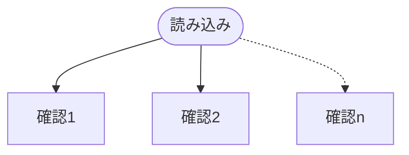

# [え、社内システム全てワンオペしている私を解雇ですか？〈試し読み増量版〉 (PASH! ブックス) Kindle版](https://www.amazon.co.jp/%E3%81%88%E3%80%81%E7%A4%BE%E5%86%85%E3%82%B7%E3%82%B9%E3%83%86%E3%83%A0%E5%85%A8%E3%81%A6%E3%83%AF%E3%83%B3%E3%82%AA%E3%83%9A%E3%81%97%E3%81%A6%E3%81%84%E3%82%8B%E7%A7%81%E3%82%92%E8%A7%A3%E9%9B%87%E3%81%A7%E3%81%99%E3%81%8B%EF%BC%9F%E3%80%88%E8%A9%A6%E3%81%97%E8%AA%AD%E3%81%BF%E5%A2%97%E9%87%8F%E7%89%88%E3%80%89-PASH-%E3%83%96%E3%83%83%E3%82%AF%E3%82%B9-%E4%B8%8B%E5%9F%8E%E7%B1%B3%E9%9B%AA-ebook/dp/B093BY66MD/ref=sr_1_1?__mk_ja_JP=%E3%82%AB%E3%82%BF%E3%82%AB%E3%83%8A&keywords=%E3%83%AF%E3%83%B3%E3%82%AA%E3%83%9A+%E8%A9%A6%E3%81%97%E8%AA%AD%E3%81%BF%E5%A2%97%E9%87%8F%E7%89%88&qid=1661070285&s=digital-text&sr=1-1)
---
## 作者
+ 著
    + 下城米雪
+ イラスト
    + icchi (イラスト)

## 登場人物
1. 佐藤
    + 主人公。
    + コスプレしながら働いている
    + 5年かけて社内システムを全自動化
    + <ruby>新<rp>（</rp><rt>あらた</rt><rp>）</rp></ruby>社長のコスト削減のやり玉にあがり、リストラされる。
1. 部長
    + 佐藤の上司。
1. <ruby>新<rp>（</rp><rt>あらた</rt><rp>）</rp></ruby>社長
    + 佐藤の元勤め先に就任した社長。
    + 働き方改革などのコスト削減を推進している。
1. 鈴木
    + 佐藤の幼馴染
    + 数か月前にスタートアップ企業(プログラマ塾)を立ち上げたばかり
    + リストラされた佐藤の優秀さを知っており、塾に引き入れる
1. 小田原
    + 鈴木のプログラマ塾へ無料体験にやってくる。
    + 仕事(プログラムの運用・改修)がうまくいかず、職場・家庭ともに苦労している。

## 佐藤がリストラされたのは、部長が原因
部長が佐藤にリストラの旨を伝えるシーンで、以下のやり取りがある。
>「佐藤さん、すまないね」
「いえ、部長が謝ることではないです」
「いいや、君たちの奮闘を伝え切れなかった私の責任だ。いくらか粘ったのだが、最後は『一人で回る仕事など、本当に必要なのか』と質問されてしまった」
溜息ひとつ。部長はどこか諦めた様子で呟いた。
「…… 言葉を返す気力を失ったよ」

さらに、佐藤のリストラが確定した時点で、部長が
> 転職活動を始めることにした

と言っている。つまり
+ 佐藤の働きぶりを見ていながら、それを上層部に伝えなかった
    + 「縁の下の力持ち」である平社員の存在が上層部にバレると、自分の地位が脅かされるため、あえてボカした報告しかしていないのでは？
    + これは佐藤に限った話ではなく、部長配下の優秀な社員が人知れず何人も辞めているのではないだろうか
+ 佐藤がいなくなった後も「社内システムをなんとか回していこう」という気すらない

## 上層部が佐藤の貢献を知らないのは不自然
+ 5年間かけて全自動化したシステムであれば、何かしら予算を使っているはず
    + ソフトウェア、ハードウェアなど
    + >あらゆる仕事を自動化することができれば、命を削って夜間に働く理由は消失する

        という文があるため、[夜間バッチ](https://e-words.jp/w/%E5%A4%9C%E9%96%93%E3%83%90%E3%83%83%E3%83%81.html#:~:text=%E5%A4%9C%E9%96%93%E3%83%90%E3%83%83%E3%83%81%E3%81%A8%E3%81%AF%E3%80%81%E3%83%87%E3%83%BC%E3%82%BF,%E3%81%A6%E5%87%A6%E7%90%86%E3%82%92%E8%A1%8C%E3%81%86%E3%81%93%E3%81%A8%E3%80%82)処理を実施している可能性もある
        + その場合、退勤後の電気代・通信量などでも把握はできるはず
+ 予算を使っているのであれば、稟議書があがっているはず
+ 稟議書を「通した」のに、使い道・成果を「知らない」のは、「申請者」ではなく「承認者」の上層部に問題がある
+ 鈴木が佐藤をプログラマ塾に引き入れるシーン
    > 「オルラビシステムって、聞いたことあるかな」
        「おーよく知ってるね。私が作ったやつじゃん」
        ケンちゃんは目を見開いた。そして、急に私の手を握って言う。
        「ずっと探していた。君が欲しい」
    + 内製システムについて、特にコネもないスタートアップ企業でも優秀さが分かるほど詳細に公開されているのに、上層部は何も知らない、なんてことはありうるのだろうか？

## 鈴木と小田原が知り合う理由が不自然
小田原がプログラマ塾を見つける流れは以下のように表現されている。
> 小田原には趣味がある。会社では多忙、家では羽虫。そんな彼が安らげる唯一の場所、通勤電車。吊り革を握り、ただ黙って虚空を見つめる時間。頭を空っぽにできることが、とても心地良い。
楽しい時間は一瞬。電車を降り、会社に向かう数分間はとても憂鬱だ。
小田原は現実逃避であちこちに目を向ける。そして、普段と違う張り紙に気が付いて足を止めた。
「真のプログラマ塾？」

小田原は
> 都内のマンションに住む三十二歳
    
とされているため、通勤電車も東京の電車と考えるのが自然。
+ [東京の電車に広告を出す費用は、100万円～10000万円/1週間](https://www.oricom.co.jp/special/pdf/transit/01_naka.pdf)[^1]
+ 短期間高費用なので、スタートアップ企業が広告を出す場としてはリスクが高すぎる
+ 口コミが狙った層に短期間で広まればすぐに掲載を止めて、月謝で回収できる
+ そうでない場合、数百万～数千万を高速で出費し続けることになる

## 小田原の問題解決描写が不自然
+ 「小田原が悩んでいるプログラムの改修を、佐藤が図に描き起こす」というシーンに、**挿絵がない!**
+ 「プログラム語で考えるか、日本語で考えるか」の違いしかなく、読者は結局「処理の読解」をしなければならない
    > 「多分ですけど、めちゃくちゃ条件分岐して設定を確かめてるんじゃないですかね。なんかコメントとかで謎の区切りがあって、いろいろな設定の確認がバーッて並んでるイメージ」
「おお、そうです、そんな感じです」
小田原は心底驚いた様子で同意した。
一方で、話を聞いた鈴木はペンを走らせる。
「つまり、こういうことですね」
丸を描いて、その中に「読み込み」と書く。
続いて「確認１」「確認２」…… 「確認ｎ」と縦に並べて記す。
「ああ、なるほど。絵にすると分かりやすいですね」

+ 「絵にすると分かりやすい」と言わせるくらいなら、絵にしないとダメだろ！
    ```mermaid
    graph TD

    読込([読み込み])
    確認1[確認1]
    確認2[確認2]
    確認n[確認n]

    読込-->確認1
    確認1-->確認2
    確認2-.->確認n
    ```

    > 「このプログラムは多くの確認を行っているから行数も多い。ですが、確認する設定の順番は全く関係ないはずだ。つまり── 」
    鈴木は紙を裏返して、もう一度、丸を描く。その中に「読み込み」と記すまでは同じ。
    「あー、なるほどなるほど、確かにそうですね」
    前の図では「確認」が縦に並んでいた。
しかし新しい図では、横に並んでいる。

    ```mermaid
    graph TD

    読込([読み込み])
    確認1[確認1]
    確認2[確認2]
    確認n[確認n]

    読込-->確認1
    読込-->確認2
    読込-.->確認n
    ```

## 鈴木の描いた図は答えになっていない
小田原の図

に対して、鈴木の図

は何の回答にもなっていない。
1. > 確認する設定の順番は全く関係ないはず
    
    とは小田原は言っておらず、鈴木の思い込みを前提とした設計になっている
    + 順番に意味がある場合
        + たいてい、こういう処理は意味がある
            + 「`確認1`が`A`だったら、`確認2`はしなくていいよね」というような、「飛ばし処理」を追加するのがお決まり
            ```mermaid
            graph TD
            開始([確認開始])
            読込([読み込み])
            終了([確認終了])

            確認1[確認1]
            確認2[確認2]
            確認3[確認3]
            確認n[確認n]

            開始-->読込
            読込-->確認1
            確認1--確認1=その他-->確認2
            確認2-->確認3
            確認3-.->確認n
            確認n-->終了

            確認1--確認1=B-->終了
            確認1--確認1=A-->確認3
            ```
    + 順番に意味がない場合
        + 「`確認n`が`確認1`より先にチェックされる時もあれば、後にチェックされる時もある」プログラムは不安定
        + テストのパターンが増え、運用開始までのコストが高くなる。
        + 個人が趣味で作るプログラムなら良いが、仕事で作るには推奨しがたい
        + そもそも、小田原の図のような設計になっているプログラムは、「そういう設計しかできないから、そうなっている」ことが多い
        + 鈴木の図に処理を変える場合
            + プログラム言語の変更
            + 他システムとの連携部分の調査
            + それらに伴うスケジュールの再見積もり
        + などが求められる
        + ワンオペしてきた佐藤と、スタートアップの鈴木という、「よそへのお伺いを立てる必要がない人」のみに許された解法である
---
+ [レビュー トップページに戻る](index_review.md)
+ [トップページに戻る](index_top.md#falhong-cha)

[^1]: ドア、中づりなどによって費用はことなるようだが、いずれも高額